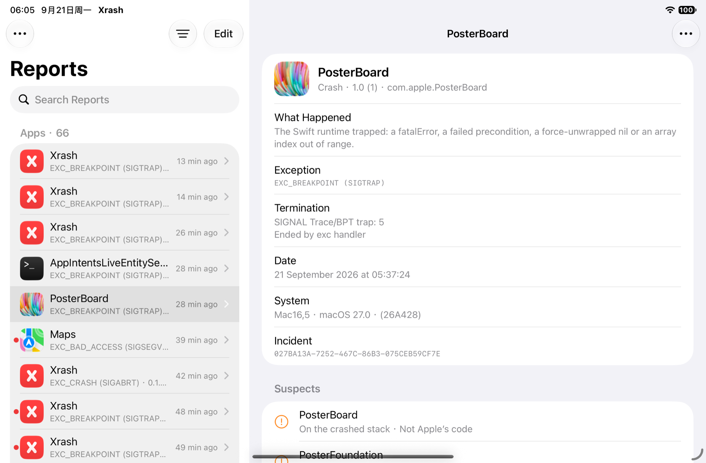

<p align="center">
  <a href="README.md">English</a> |
  <a href="README_zh-Hans.md">简体中文</a>
</p>

# Xrash

在 iPhone、iPad 或 Mac 上查看、符号化并分享崩溃报告。在受支持的系统环境中安装 Xrash，即可打开系统写下的每一份报告，而不只是你自己 App 的。



## 安装

在受支持的设备上，在你常用的包管理器中添加 OwnGoal Studio 软件源：

**[apt.owngoal.dev](https://apt.owngoal.dev/)**

也可从 [GitHub Releases](https://github.com/owngoal-dev/Xrash/releases) 下载。请选择与引导环境匹配的文件。

| 安装方式 | 软件包 |
| --- | --- |
| [roothide](https://github.com/roothide) 引导环境 | `iphoneos-arm64e` `.deb` |
| Rootless 引导环境（`/var/jb`） | `iphoneos-arm64` `.deb` |
| Mac（Apple 芯片或 Intel） | `macos` `.zip` |

在 Mac 上，解压后把 Xrash 移到“应用程序”。应用是 ad-hoc 签名的，需要用 `xattr -dr com.apple.quarantine /Applications/Xrash.app` 清除一次隔离标记；如果 macOS 询问，请在**登录项**中允许它的辅助程序。Mac 上的报告你本来就能读取，所以那里的辅助程序以你的身份运行，而不是 root。

需要 iOS 15 或更高版本。`.deb` 除应用外还会安装一个小型 root 辅助程序，以及按需启动它的 launchd 任务。辅助程序只负责打开报告文件、二进制文件和系统符号缓存并交给应用；它自己不读取内容，不在后台常驻，空闲时即退出。Xrash 不注入任何进程，也不安装任何 hook：它只读取系统已经写下的内容。

## 功能

- **所有报告**：崩溃、卡死、内存（Jetsam）事件、内核 panic 和诊断报告，包括系统已标记为“已同步”的报告。报告按 App、服务、Jetsam 和其他分组，支持搜索、筛选和排序。
- **说人话**：异常、信号和终止原因用一句话解释，原始代码同时保留。
- **符号化**：利用设备上的二进制文件和系统自带的符号缓存，把地址还原成函数名。Swift 和 C++ 名称会被还原。添加符号后可随时重新符号化。
- **你的 dSYM**：导入 `.dSYM` 文件夹或其 zip 包，即可看到自己代码的文件名和行号；也可以从项目的 GitHub Releases 里选一个 tag，Xrash 会下载随该版本发布的 dSYM。Xrash 会列出最近的报告还缺哪些符号。
- **嫌疑对象**：查看崩溃线程上有哪个插件或注入的库、它来自哪个软件包、何时安装。嫌疑对象按理由排序，不会只给一个结论。
- **三种视图**：在摘要、完整的经典崩溃日志和原始文件之间切换，支持查找、自动换行和调整字号。
- **报告崩溃**：把这次崩溃与其他进程的相关报告合并（Xrash 会建议哪些报告属于同一事件），添加备注，导出为单个 `.xrashreport` 文件，其中包含各份报告、一份 PDF，以及可选的相关二进制文件。在另一台设备上打开 `.xrashreport`，看到的内容与提交时完全一致。
- **导入与导出**：从“文件”或其他 App 打开 `.ips` 和 `.crash` 文件。可将报告分享为崩溃日志、原始文件、JSON 或 Markdown。
- **清理**：逐个、批量或一次性删除报告，也可让 Xrash 自动删除超过指定天数的报告。

界面提供 13 种语言：阿拉伯语、英语、法语、德语、意大利语、日语、韩语、葡萄牙语（巴西）、俄语、简体中文、西班牙语、繁体中文和越南语。

## 使用 Xrash

打开**报告**并轻点一份报告。摘要显示发生了什么、嫌疑对象和崩溃线程；用报告的 ••• 菜单切换到完整日志或原始文件。轻点**符号化**即可还原各帧的名称。

要在每份报告里还原系统帧，请打开**符号**，每个系统版本提取一次系统符号。要看到自己 App 的行号，请在同一处导入它的 dSYM；UUID 必须与崩溃的那次构建一致。

要把崩溃发给开发者，请打开报告，选择**报告崩溃…**，关联相关报告，然后导出。导出的文件保存在**已保存**中。只有开发者要求时才包含二进制文件：它们会让文件大很多。

## 从源码构建

```sh
make check            # 工程与打包校验
make harness          # 在 Mac 上运行测试
make deb-all          # roothide 与 rootless .deb
make deb              # roothide .deb
make sim              # Debug 构建并安装到已启动的模拟器
make audit-floor      # 按 iOS 15 审计构建产物
make vphone           # 通过 iproxy 把 rootless .deb 安装到 vphone
make mac-run          # 构建并打开 Mac 应用及其辅助程序
make mac-zip          # 签名并打包 Mac 应用
```

`make check` 需要 xcodebuild、ldid 和 dpkg-deb。

贡献者须知见 [AGENTS.md](AGENTS.md)。

## 许可证

Xrash 以 [MIT 许可证](LICENSE) 发布。

`.deb` 软件包不面向 App Store。

加入 [Discord](https://discord.gg/vqhDEep2mN) 社区。
